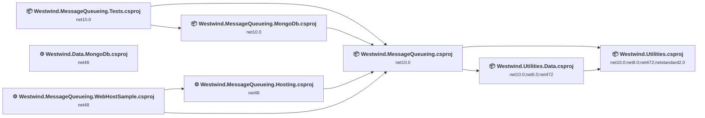
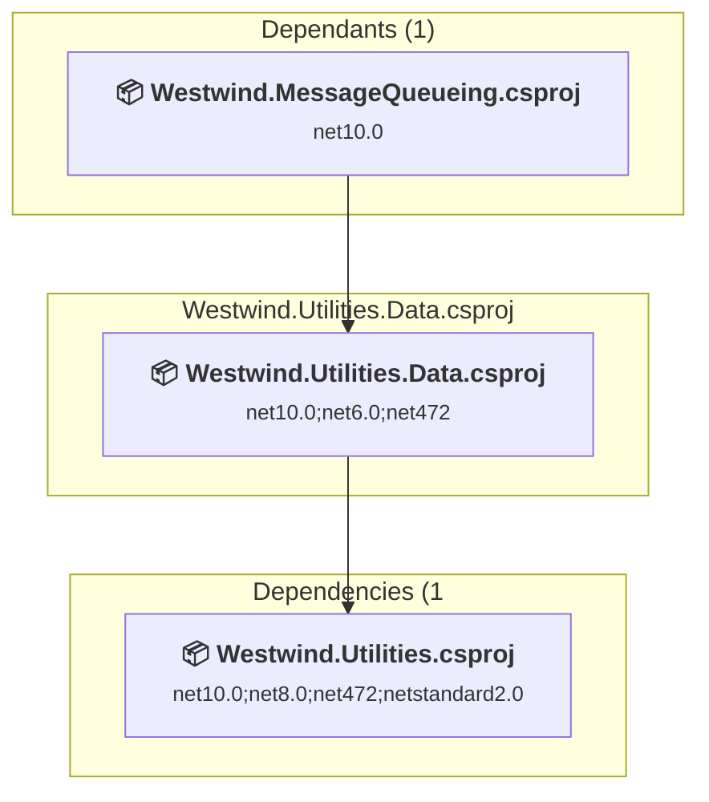
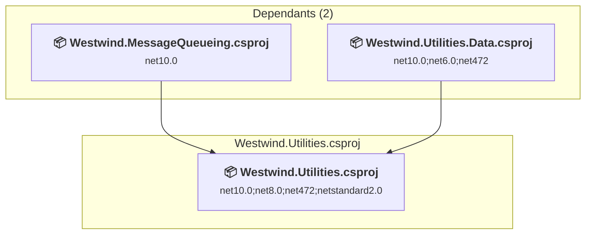
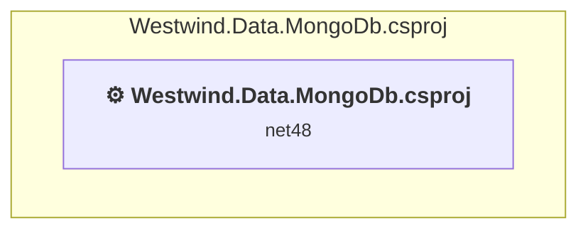
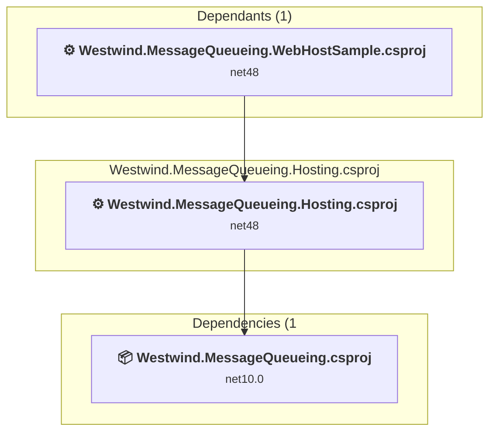
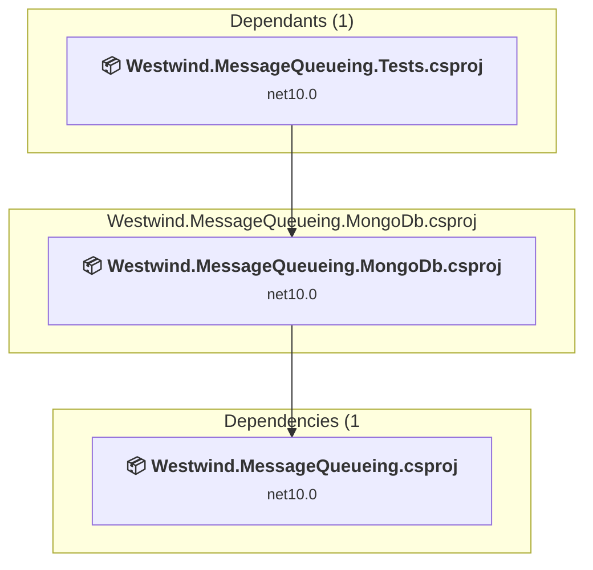
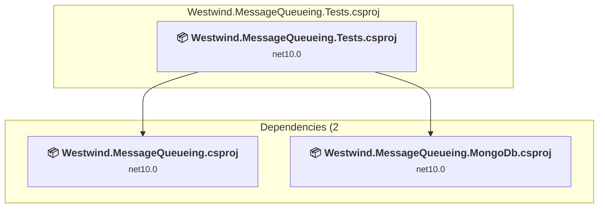
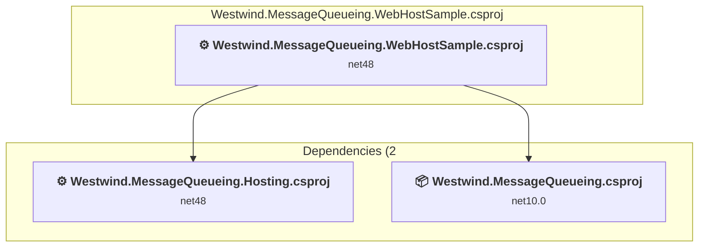
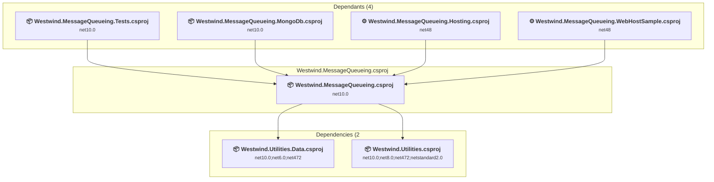

# Projects and dependencies analysis

This document provides a comprehensive overview of the projects and their dependencies in the context of upgrading to .NETCoreApp,Version=v10.0.

## Table of Contents

- [Executive Summary](#executive-Summary)
  - [Highlevel Metrics](#highlevel-metrics)
  - [Projects Compatibility](#projects-compatibility)
  - [Package Compatibility](#package-compatibility)
  - [API Compatibility](#api-compatibility)
- [Aggregate NuGet packages details](#aggregate-nuget-packages-details)
- [Top API Migration Challenges](#top-api-migration-challenges)
  - [Technologies and Features](#technologies-and-features)
  - [Most Frequent API Issues](#most-frequent-api-issues)
- [Projects Relationship Graph](#projects-relationship-graph)
- [Project Details](#project-details)

  - [D:\projects\Westwind.Utilities\Westwind.Utilities.Data\Westwind.Utilities.Data.csproj](#d:projectswestwindutilitieswestwindutilitiesdatawestwindutilitiesdatacsproj)
  - [D:\projects\Westwind.Utilities\Westwind.Utilities\Westwind.Utilities.csproj](#d:projectswestwindutilitieswestwindutilitieswestwindutilitiescsproj)
  - [D:\projects\WestwindToolkit\Westwind.Data.MongoDb\Westwind.Data.MongoDb.csproj](#d:projectswestwindtoolkitwestwinddatamongodbwestwinddatamongodbcsproj)
  - [Westwind.MessageQueueing.Hosting\Westwind.MessageQueueing.Hosting.csproj](#westwindmessagequeueinghostingwestwindmessagequeueinghostingcsproj)
  - [Westwind.MessageQueueing.MongoDb\Westwind.MessageQueueing.MongoDb.csproj](#westwindmessagequeueingmongodbwestwindmessagequeueingmongodbcsproj)
  - [Westwind.MessageQueueing.Tests\Westwind.MessageQueueing.Tests.csproj](#westwindmessagequeueingtestswestwindmessagequeueingtestscsproj)
  - [Westwind.MessageQueueing.WebHostSample\Westwind.MessageQueueing.WebHostSample.csproj](#westwindmessagequeueingwebhostsamplewestwindmessagequeueingwebhostsamplecsproj)
  - [Westwind.MessageQueueing\Westwind.MessageQueueing.csproj](#westwindmessagequeueingwestwindmessagequeueingcsproj)

## Executive Summary

### Highlevel Metrics

| Metric | Count | Status |
| :--- | :---: | :--- |
| Total Projects | 8 | 5 require upgrade |
| Total NuGet Packages | 28 | 13 need upgrade |
| Total Code Files | 95 |  |
| Total Code Files with Incidents | 27 |  |
| Total Lines of Code | 31750 |  |
| Total Number of Issues | 198 |  |
| Estimated LOC to modify | 145+ | at least 0.5% of codebase |

### Projects Compatibility

| Project | Target Framework | Difficulty | Package Issues | API Issues | Est. LOC Impact | Description |
| :--- | :---: | :---: | :---: | :---: | :---: | :--- |
| [D:\projects\Westwind.Utilities\Westwind.Utilities.Data\Westwind.Utilities.Data.csproj](#d:projectswestwindutilitieswestwindutilitiesdatawestwindutilitiesdatacsproj) | net10.0;net6.0;net472 | 🟢 Low | 0 | 0 |  | ClassLibrary, Sdk Style = True |
| [D:\projects\Westwind.Utilities\Westwind.Utilities\Westwind.Utilities.csproj](#d:projectswestwindutilitieswestwindutilitieswestwindutilitiescsproj) | net10.0;net8.0;net472;netstandard2.0 | 🟢 Low | 0 | 73 | 73+ | ClassLibrary, Sdk Style = True |
| [D:\projects\WestwindToolkit\Westwind.Data.MongoDb\Westwind.Data.MongoDb.csproj](#d:projectswestwindtoolkitwestwinddatamongodbwestwinddatamongodbcsproj) | net48 | 🟢 Low | 2 | 16 | 16+ | ClassicClassLibrary, Sdk Style = False |
| [Westwind.MessageQueueing.Hosting\Westwind.MessageQueueing.Hosting.csproj](#westwindmessagequeueinghostingwestwindmessagequeueinghostingcsproj) | net48 | 🟡 Medium | 20 | 49 | 49+ | ClassicClassLibrary, Sdk Style = False |
| [Westwind.MessageQueueing.MongoDb\Westwind.MessageQueueing.MongoDb.csproj](#westwindmessagequeueingmongodbwestwindmessagequeueingmongodbcsproj) | net10.0 | ✅ None | 0 | 0 |  | ClassLibrary, Sdk Style = True |
| [Westwind.MessageQueueing.Tests\Westwind.MessageQueueing.Tests.csproj](#westwindmessagequeueingtestswestwindmessagequeueingtestscsproj) | net10.0 | ✅ None | 0 | 0 |  | DotNetCoreApp, Sdk Style = True |
| [Westwind.MessageQueueing.WebHostSample\Westwind.MessageQueueing.WebHostSample.csproj](#westwindmessagequeueingwebhostsamplewestwindmessagequeueingwebhostsamplecsproj) | net48 | 🔴 High | 21 | 7 | 7+ | Wap, Sdk Style = False |
| [Westwind.MessageQueueing\Westwind.MessageQueueing.csproj](#westwindmessagequeueingwestwindmessagequeueingcsproj) | net10.0 | ✅ None | 0 | 0 |  | ClassLibrary, Sdk Style = True |

### Package Compatibility

| Status | Count | Percentage |
| :--- | :---: | :---: |
| ✅ Compatible | 15 | 53.6% |
| ⚠️ Incompatible | 10 | 35.7% |
| 🔄 Upgrade Recommended | 3 | 10.7% |
| ***Total NuGet Packages*** | ***28*** | ***100%*** |

### API Compatibility

| Category | Count | Impact |
| :--- | :---: | :--- |
| 🔴 Binary Incompatible | 51 | High - Require code changes |
| 🟡 Source Incompatible | 29 | Medium - Needs re-compilation and potential conflicting API error fixing |
| 🔵 Behavioral change | 65 | Low - Behavioral changes that may require testing at runtime |
| ✅ Compatible | 14285 |  |
| ***Total APIs Analyzed*** | ***14430*** |  |

## Aggregate NuGet packages details

| Package | Current Version | Suggested Version | Projects | Description |
| :--- | :---: | :---: | :--- | :--- |
| coverlet.collector | 6.0.4 |  | [Westwind.MessageQueueing.Tests.csproj](#westwindmessagequeueingtestswestwindmessagequeueingtestscsproj) | ✅Compatible |
| jQuery | 1.6.4 | 3.7.1 | [Westwind.MessageQueueing.WebHostSample.csproj](#westwindmessagequeueingwebhostsamplewestwindmessagequeueingwebhostsamplecsproj) | NuGet package contains security vulnerability |
| lodash | 2.4.1 |  | [Westwind.MessageQueueing.WebHostSample.csproj](#westwindmessagequeueingwebhostsamplewestwindmessagequeueingwebhostsamplecsproj) | ✅Compatible |
| Microsoft.AspNet.Cors | 5.0.0 |  | [Westwind.MessageQueueing.Hosting.csproj](#westwindmessagequeueinghostingwestwindmessagequeueinghostingcsproj) [Westwind.MessageQueueing.WebHostSample.csproj](#westwindmessagequeueingwebhostsamplewestwindmessagequeueingwebhostsamplecsproj) | NuGet package functionality is included with framework reference |
| Microsoft.AspNet.Razor | 3.2.2 |  | [Westwind.MessageQueueing.Hosting.csproj](#westwindmessagequeueinghostingwestwindmessagequeueinghostingcsproj) [Westwind.MessageQueueing.WebHostSample.csproj](#westwindmessagequeueingwebhostsamplewestwindmessagequeueingwebhostsamplecsproj) | NuGet package functionality is included with framework reference |
| Microsoft.AspNet.SignalR.Core | 2.2.0 |  | [Westwind.MessageQueueing.Hosting.csproj](#westwindmessagequeueinghostingwestwindmessagequeueinghostingcsproj) [Westwind.MessageQueueing.WebHostSample.csproj](#westwindmessagequeueingwebhostsamplewestwindmessagequeueingwebhostsamplecsproj) | Needs to be replaced with Replace with new package Microsoft.AspNetCore.SignalR.Client=10.0.1 |
| Microsoft.AspNet.SignalR.JS | 2.2.0 |  | [Westwind.MessageQueueing.WebHostSample.csproj](#westwindmessagequeueingwebhostsamplewestwindmessagequeueingwebhostsamplecsproj) | ✅Compatible |
| Microsoft.AspNet.SignalR.Owin | 1.2.2 |  | [Westwind.MessageQueueing.Hosting.csproj](#westwindmessagequeueinghostingwestwindmessagequeueinghostingcsproj) [Westwind.MessageQueueing.WebHostSample.csproj](#westwindmessagequeueingwebhostsamplewestwindmessagequeueingwebhostsamplecsproj) | ⚠️NuGet package is incompatible |
| Microsoft.AspNet.SignalR.SystemWeb | 2.2.0 |  | [Westwind.MessageQueueing.Hosting.csproj](#westwindmessagequeueinghostingwestwindmessagequeueinghostingcsproj) [Westwind.MessageQueueing.WebHostSample.csproj](#westwindmessagequeueingwebhostsamplewestwindmessagequeueingwebhostsamplecsproj) | ⚠️NuGet package is incompatible |
| Microsoft.AspNet.WebPages | 3.2.2 |  | [Westwind.MessageQueueing.Hosting.csproj](#westwindmessagequeueinghostingwestwindmessagequeueinghostingcsproj) [Westwind.MessageQueueing.WebHostSample.csproj](#westwindmessagequeueingwebhostsamplewestwindmessagequeueingwebhostsamplecsproj) | NuGet package functionality is included with framework reference |
| Microsoft.Data.SqlClient | 6.1.3 |  | [Westwind.Utilities.Data.csproj](#d:projectswestwindutilitieswestwindutilitiesdatawestwindutilitiesdatacsproj) | ✅Compatible |
| Microsoft.NET.Test.Sdk | 18.0.1 |  | [Westwind.MessageQueueing.Tests.csproj](#westwindmessagequeueingtestswestwindmessagequeueingtestscsproj) | ✅Compatible |
| Microsoft.Owin | 3.0.1 |  | [Westwind.MessageQueueing.Hosting.csproj](#westwindmessagequeueinghostingwestwindmessagequeueinghostingcsproj) [Westwind.MessageQueueing.WebHostSample.csproj](#westwindmessagequeueingwebhostsamplewestwindmessagequeueingwebhostsamplecsproj) | ⚠️NuGet package is incompatible |
| Microsoft.Owin.Cors | 3.0.0 |  | [Westwind.MessageQueueing.Hosting.csproj](#westwindmessagequeueinghostingwestwindmessagequeueinghostingcsproj) [Westwind.MessageQueueing.WebHostSample.csproj](#westwindmessagequeueingwebhostsamplewestwindmessagequeueingwebhostsamplecsproj) | ⚠️NuGet package is incompatible |
| Microsoft.Owin.Host.SystemWeb | 3.0.0 |  | [Westwind.MessageQueueing.WebHostSample.csproj](#westwindmessagequeueingwebhostsamplewestwindmessagequeueingwebhostsamplecsproj) | ⚠️NuGet package is incompatible |
| Microsoft.Owin.Host.SystemWeb | 3.0.1 |  | [Westwind.MessageQueueing.Hosting.csproj](#westwindmessagequeueinghostingwestwindmessagequeueinghostingcsproj) | ⚠️NuGet package is incompatible |
| Microsoft.Owin.Security | 3.0.1 |  | [Westwind.MessageQueueing.Hosting.csproj](#westwindmessagequeueinghostingwestwindmessagequeueinghostingcsproj) [Westwind.MessageQueueing.WebHostSample.csproj](#westwindmessagequeueingwebhostsamplewestwindmessagequeueingwebhostsamplecsproj) | ⚠️NuGet package is incompatible |
| Microsoft.Web.Infrastructure | 1.0.0.0 |  | [Westwind.MessageQueueing.Hosting.csproj](#westwindmessagequeueinghostingwestwindmessagequeueinghostingcsproj) [Westwind.MessageQueueing.WebHostSample.csproj](#westwindmessagequeueingwebhostsamplewestwindmessagequeueingwebhostsamplecsproj) | NuGet package functionality is included with framework reference |
| mongocsharpdriver | 1.11.0 | 2.30.0 | [Westwind.Data.MongoDb.csproj](#d:projectswestwindtoolkitwestwinddatamongodbwestwinddatamongodbcsproj) | ⚠️NuGet package is incompatible |
| mongocsharpdriver | 1.9.2 |  | [Westwind.MessageQueueing.MongoDb.csproj](#westwindmessagequeueingmongodbwestwindmessagequeueingmongodbcsproj) | ✅Compatible |
| MSTest.TestAdapter | 4.0.2 |  | [Westwind.MessageQueueing.Tests.csproj](#westwindmessagequeueingtestswestwindmessagequeueingtestscsproj) | ✅Compatible |
| MSTest.TestFramework | 4.0.2 |  | [Westwind.MessageQueueing.Tests.csproj](#westwindmessagequeueingtestswestwindmessagequeueingtestscsproj) | ✅Compatible |
| Newtonsoft.Json | 13.0.3 | 13.0.4 | [Westwind.Data.MongoDb.csproj](#d:projectswestwindtoolkitwestwinddatamongodbwestwinddatamongodbcsproj) | NuGet package upgrade is recommended |
| Newtonsoft.Json | 13.0.4 |  | [Westwind.Utilities.csproj](#d:projectswestwindutilitieswestwindutilitieswestwindutilitiescsproj) | ✅Compatible |
| Newtonsoft.Json | 7.0.1 | 13.0.4 | [Westwind.MessageQueueing.Hosting.csproj](#westwindmessagequeueinghostingwestwindmessagequeueinghostingcsproj) [Westwind.MessageQueueing.WebHostSample.csproj](#westwindmessagequeueingwebhostsamplewestwindmessagequeueingwebhostsamplecsproj) | NuGet package upgrade is recommended |
| Owin | 1.0 |  | [Westwind.MessageQueueing.Hosting.csproj](#westwindmessagequeueinghostingwestwindmessagequeueinghostingcsproj) [Westwind.MessageQueueing.WebHostSample.csproj](#westwindmessagequeueingwebhostsamplewestwindmessagequeueingwebhostsamplecsproj) | ⚠️NuGet package is incompatible |
| Westwind.Utilities | 2.64 | 5.2.1 | [Westwind.MessageQueueing.Hosting.csproj](#westwindmessagequeueinghostingwestwindmessagequeueinghostingcsproj) [Westwind.MessageQueueing.WebHostSample.csproj](#westwindmessagequeueingwebhostsamplewestwindmessagequeueingwebhostsamplecsproj) | ⚠️NuGet package is incompatible |
| Westwind.Utilities | 4.0.20 |  | [Westwind.Data.MongoDb.csproj](#d:projectswestwindtoolkitwestwinddatamongodbwestwinddatamongodbcsproj) | ✅Compatible |

## Top API Migration Challenges

### Technologies and Features

| Technology | Issues | Percentage | Migration Path |
| :--- | :---: | :---: | :--- |
| Legacy Configuration System | 12 | 8.3% | Legacy XML-based configuration system (app.config/web.config) that has been replaced by a more flexible configuration model in .NET Core. The old system was rigid and XML-based. Migrate to Microsoft.Extensions.Configuration with JSON/environment variables; use System.Configuration.ConfigurationManager NuGet package as interim bridge if needed. |
| ASP.NET Framework (System.Web) | 9 | 6.2% | Legacy ASP.NET Framework APIs for web applications (System.Web.*) that don't exist in ASP.NET Core due to architectural differences. ASP.NET Core represents a complete redesign of the web framework. Migrate to ASP.NET Core equivalents or consider System.Web.Adapters package for compatibility. |

### Most Frequent API Issues

| API | Count | Percentage | Category |
| :--- | :---: | :---: | :--- |
| T:System.Uri | 26 | 17.9% | Behavioral Change |
| P:Microsoft.AspNet.SignalR.Hub.Clients | 15 | 10.3% | Binary Incompatible |
| T:System.Net.Http.HttpContent | 13 | 9.0% | Behavioral Change |
| M:System.Uri.#ctor(System.String) | 12 | 8.3% | Behavioral Change |
| T:Microsoft.AspNet.SignalR.IHubContext | 10 | 6.9% | Binary Incompatible |
| T:System.Xml.Serialization.XmlSerializer | 6 | 4.1% | Behavioral Change |
| M:System.Net.WebClient.#ctor | 5 | 3.4% | Source Incompatible |
| P:Microsoft.AspNet.SignalR.IHubContext.Clients | 3 | 2.1% | Binary Incompatible |
| T:System.Web.Hosting.HostingEnvironment | 3 | 2.1% | Source Incompatible |
| M:System.Net.WebRequest.Create(System.String) | 3 | 2.1% | Source Incompatible |
| P:System.Uri.PathAndQuery | 3 | 2.1% | Behavioral Change |
| P:System.Configuration.ConnectionStringSettings.ConnectionString | 2 | 1.4% | Source Incompatible |
| T:System.Configuration.ConfigurationManager | 2 | 1.4% | Source Incompatible |
| T:System.Configuration.ConnectionStringSettingsCollection | 2 | 1.4% | Source Incompatible |
| P:System.Configuration.ConfigurationManager.ConnectionStrings | 2 | 1.4% | Source Incompatible |
| T:System.Configuration.ConnectionStringSettings | 2 | 1.4% | Source Incompatible |
| P:System.Configuration.ConnectionStringSettingsCollection.Item(System.String) | 2 | 1.4% | Source Incompatible |
| M:System.Web.Hosting.HostingEnvironment.RegisterObject(System.Web.Hosting.IRegisteredObject) | 2 | 1.4% | Binary Incompatible |
| T:System.Net.ServicePointManager | 2 | 1.4% | Source Incompatible |
| P:System.Uri.AbsolutePath | 2 | 1.4% | Behavioral Change |
| T:Microsoft.AspNet.SignalR.Hubs.IHubIncomingInvokerContext | 1 | 0.7% | Binary Incompatible |
| T:Microsoft.AspNet.SignalR.IRequest | 1 | 0.7% | Binary Incompatible |
| T:Microsoft.AspNet.SignalR.Hubs.HubDescriptor | 1 | 0.7% | Binary Incompatible |
| T:Microsoft.AspNet.SignalR.Hosting.INameValueCollection | 1 | 0.7% | Binary Incompatible |
| P:Microsoft.AspNet.SignalR.IRequest.QueryString | 1 | 0.7% | Binary Incompatible |
| P:Microsoft.AspNet.SignalR.Hosting.INameValueCollection.Item(System.String) | 1 | 0.7% | Binary Incompatible |
| M:Microsoft.AspNet.SignalR.AuthorizeAttribute.#ctor | 1 | 0.7% | Binary Incompatible |
| T:Microsoft.AspNet.SignalR.AuthorizeAttribute | 1 | 0.7% | Binary Incompatible |
| T:Microsoft.AspNet.SignalR.GlobalHost | 1 | 0.7% | Binary Incompatible |
| T:Microsoft.AspNet.SignalR.Infrastructure.IConnectionManager | 1 | 0.7% | Binary Incompatible |
| P:Microsoft.AspNet.SignalR.GlobalHost.ConnectionManager | 1 | 0.7% | Binary Incompatible |
| M:Microsoft.AspNet.SignalR.Infrastructure.IConnectionManager.GetHubContext''1 | 1 | 0.7% | Binary Incompatible |
| M:Microsoft.AspNet.SignalR.Hub.#ctor | 1 | 0.7% | Binary Incompatible |
| T:Microsoft.AspNet.SignalR.Hub | 1 | 0.7% | Binary Incompatible |
| M:System.Web.Hosting.HostingEnvironment.UnregisterObject(System.Web.Hosting.IRegisteredObject) | 1 | 0.7% | Binary Incompatible |
| T:System.Web.Hosting.IRegisteredObject | 1 | 0.7% | Binary Incompatible |
| T:Owin.OwinExtensions | 1 | 0.7% | Binary Incompatible |
| M:Owin.OwinExtensions.RunSignalR(Owin.IAppBuilder,Microsoft.AspNet.SignalR.HubConfiguration) | 1 | 0.7% | Binary Incompatible |
| P:Microsoft.AspNet.SignalR.HubConfiguration.EnableDetailedErrors | 1 | 0.7% | Binary Incompatible |
| T:Microsoft.AspNet.SignalR.HubConfiguration | 1 | 0.7% | Binary Incompatible |
| M:Microsoft.AspNet.SignalR.HubConfiguration.#ctor | 1 | 0.7% | Binary Incompatible |
| M:System.Web.HttpApplication.#ctor | 1 | 0.7% | Source Incompatible |
| T:System.Web.HttpApplication | 1 | 0.7% | Source Incompatible |
| M:System.String.Split(System.ReadOnlySpan{System.Char}) | 1 | 0.7% | Source Incompatible |
| M:System.Uri.#ctor(System.Uri,System.Uri) | 1 | 0.7% | Behavioral Change |
| M:System.Uri.#ctor(System.String,System.UriKind) | 1 | 0.7% | Behavioral Change |
| M:System.Net.Http.HttpContent.ReadAsStreamAsync | 1 | 0.7% | Behavioral Change |
| M:System.TimeSpan.FromHours(System.Double) | 1 | 0.7% | Source Incompatible |

## Projects Relationship Graph

Legend:
📦 SDK-style project
⚙️ Classic project

## Project Details

### D:\projects\Westwind.Utilities\Westwind.Utilities.Data\Westwind.Utilities.Data.csproj

#### Project Info

- **Current Target Framework:** net10.0;net6.0;net472
- **Proposed Target Framework:** net10.0;net6.0;net472;net10.0
- **SDK-style**: True
- **Project Kind:** ClassLibrary
- **Dependencies**: 1
- **Dependants**: 1
- **Number of Files**: 9
- **Number of Files with Incidents**: 1
- **Lines of Code**: 3728
- **Estimated LOC to modify**: 0+ (at least 0.0% of the project)

#### Dependency Graph

Legend:
📦 SDK-style project
⚙️ Classic project

### API Compatibility

| Category | Count | Impact |
| :--- | :---: | :--- |
| 🔴 Binary Incompatible | 0 | High - Require code changes |
| 🟡 Source Incompatible | 0 | Medium - Needs re-compilation and potential conflicting API error fixing |
| 🔵 Behavioral change | 0 | Low - Behavioral changes that may require testing at runtime |
| ✅ Compatible | 1833 |  |
| ***Total APIs Analyzed*** | ***1833*** |  |

#### Project Package References

| Package | Type | Current Version | Suggested Version | Description |
| :--- | :---: | :---: | :---: | :--- |
| Microsoft.Data.SqlClient | Explicit | 6.1.3 |  | ✅Compatible |

### D:\projects\Westwind.Utilities\Westwind.Utilities\Westwind.Utilities.csproj

#### Project Info

- **Current Target Framework:** net10.0;net8.0;net472;netstandard2.0
- **Proposed Target Framework:** net10.0;net8.0;net472;netstandard2.0;net10.0
- **SDK-style**: True
- **Project Kind:** ClassLibrary
- **Dependencies**: 0
- **Dependants**: 2
- **Number of Files**: 49
- **Number of Files with Incidents**: 16
- **Lines of Code**: 19349
- **Estimated LOC to modify**: 73+ (at least 0.4% of the project)

#### Dependency Graph

Legend:
📦 SDK-style project
⚙️ Classic project

### API Compatibility

| Category | Count | Impact |
| :--- | :---: | :--- |
| 🔴 Binary Incompatible | 0 | High - Require code changes |
| 🟡 Source Incompatible | 12 | Medium - Needs re-compilation and potential conflicting API error fixing |
| 🔵 Behavioral change | 61 | Low - Behavioral changes that may require testing at runtime |
| ✅ Compatible | 10458 |  |
| ***Total APIs Analyzed*** | ***10531*** |  |

#### Project Package References

| Package | Type | Current Version | Suggested Version | Description |
| :--- | :---: | :---: | :---: | :--- |
| Newtonsoft.Json | Explicit | 13.0.4 |  | ✅Compatible |

### D:\projects\WestwindToolkit\Westwind.Data.MongoDb\Westwind.Data.MongoDb.csproj

#### Project Info

- **Current Target Framework:** net48
- **Proposed Target Framework:** net10.0
- **SDK-style**: False
- **Project Kind:** ClassicClassLibrary
- **Dependencies**: 0
- **Dependants**: 0
- **Number of Files**: 10
- **Number of Files with Incidents**: 3
- **Lines of Code**: 2747
- **Estimated LOC to modify**: 16+ (at least 0.6% of the project)

#### Dependency Graph

Legend:
📦 SDK-style project
⚙️ Classic project

### API Compatibility

| Category | Count | Impact |
| :--- | :---: | :--- |
| 🔴 Binary Incompatible | 0 | High - Require code changes |
| 🟡 Source Incompatible | 12 | Medium - Needs re-compilation and potential conflicting API error fixing |
| 🔵 Behavioral change | 4 | Low - Behavioral changes that may require testing at runtime |
| ✅ Compatible | 1534 |  |
| ***Total APIs Analyzed*** | ***1550*** |  |

#### Project Package References

| Package | Type | Current Version | Suggested Version | Description |
| :--- | :---: | :---: | :---: | :--- |
| mongocsharpdriver | Explicit | 1.11.0 | 2.30.0 | ⚠️NuGet package is incompatible |
| Newtonsoft.Json | Explicit | 13.0.3 | 13.0.4 | NuGet package upgrade is recommended |
| Westwind.Utilities | Explicit | 4.0.20 |  | ✅Compatible |

#### Project Technologies and Features

| Technology | Issues | Percentage | Migration Path |
| :--- | :---: | :---: | :--- |
| Legacy Configuration System | 12 | 75.0% | Legacy XML-based configuration system (app.config/web.config) that has been replaced by a more flexible configuration model in .NET Core. The old system was rigid and XML-based. Migrate to Microsoft.Extensions.Configuration with JSON/environment variables; use System.Configuration.ConfigurationManager NuGet package as interim bridge if needed. |

### Westwind.MessageQueueing.Hosting\Westwind.MessageQueueing.Hosting.csproj

#### Project Info

- **Current Target Framework:** net48
- **Proposed Target Framework:** net10.0
- **SDK-style**: False
- **Project Kind:** ClassicClassLibrary
- **Dependencies**: 1
- **Dependants**: 1
- **Number of Files**: 8
- **Number of Files with Incidents**: 4
- **Lines of Code**: 673
- **Estimated LOC to modify**: 49+ (at least 7.3% of the project)

#### Dependency Graph

Legend:
📦 SDK-style project
⚙️ Classic project

### API Compatibility

| Category | Count | Impact |
| :--- | :---: | :--- |
| 🔴 Binary Incompatible | 46 | High - Require code changes |
| 🟡 Source Incompatible | 3 | Medium - Needs re-compilation and potential conflicting API error fixing |
| 🔵 Behavioral change | 0 | Low - Behavioral changes that may require testing at runtime |
| ✅ Compatible | 377 |  |
| ***Total APIs Analyzed*** | ***426*** |  |

#### Project Technologies and Features

| Technology | Issues | Percentage | Migration Path |
| :--- | :---: | :---: | :--- |
| ASP.NET Framework (System.Web) | 7 | 14.3% | Legacy ASP.NET Framework APIs for web applications (System.Web.*) that don't exist in ASP.NET Core due to architectural differences. ASP.NET Core represents a complete redesign of the web framework. Migrate to ASP.NET Core equivalents or consider System.Web.Adapters package for compatibility. |

### Westwind.MessageQueueing.MongoDb\Westwind.MessageQueueing.MongoDb.csproj

#### Project Info

- **Current Target Framework:** net10.0✅
- **SDK-style**: True
- **Project Kind:** ClassLibrary
- **Dependencies**: 1
- **Dependants**: 1
- **Number of Files**: 1
- **Lines of Code**: 393
- **Estimated LOC to modify**: 0+ (at least 0.0% of the project)

#### Dependency Graph

Legend:
📦 SDK-style project
⚙️ Classic project

### API Compatibility

| Category | Count | Impact |
| :--- | :---: | :--- |
| 🔴 Binary Incompatible | 0 | High - Require code changes |
| 🟡 Source Incompatible | 0 | Medium - Needs re-compilation and potential conflicting API error fixing |
| 🔵 Behavioral change | 0 | Low - Behavioral changes that may require testing at runtime |
| ✅ Compatible | 0 |  |
| ***Total APIs Analyzed*** | ***0*** |  |

### Westwind.MessageQueueing.Tests\Westwind.MessageQueueing.Tests.csproj

#### Project Info

- **Current Target Framework:** net10.0✅
- **SDK-style**: True
- **Project Kind:** DotNetCoreApp
- **Dependencies**: 2
- **Dependants**: 0
- **Number of Files**: 8
- **Lines of Code**: 1651
- **Estimated LOC to modify**: 0+ (at least 0.0% of the project)

#### Dependency Graph

Legend:
📦 SDK-style project
⚙️ Classic project

### API Compatibility

| Category | Count | Impact |
| :--- | :---: | :--- |
| 🔴 Binary Incompatible | 0 | High - Require code changes |
| 🟡 Source Incompatible | 0 | Medium - Needs re-compilation and potential conflicting API error fixing |
| 🔵 Behavioral change | 0 | Low - Behavioral changes that may require testing at runtime |
| ✅ Compatible | 0 |  |
| ***Total APIs Analyzed*** | ***0*** |  |

### Westwind.MessageQueueing.WebHostSample\Westwind.MessageQueueing.WebHostSample.csproj

#### Project Info

- **Current Target Framework:** net48
- **Proposed Target Framework:** net10.0
- **SDK-style**: False
- **Project Kind:** Wap
- **Dependencies**: 2
- **Dependants**: 0
- **Number of Files**: 523
- **Number of Files with Incidents**: 3
- **Lines of Code**: 466
- **Estimated LOC to modify**: 7+ (at least 1.5% of the project)

#### Dependency Graph

Legend:
📦 SDK-style project
⚙️ Classic project

### API Compatibility

| Category | Count | Impact |
| :--- | :---: | :--- |
| 🔴 Binary Incompatible | 5 | High - Require code changes |
| 🟡 Source Incompatible | 2 | Medium - Needs re-compilation and potential conflicting API error fixing |
| 🔵 Behavioral change | 0 | Low - Behavioral changes that may require testing at runtime |
| ✅ Compatible | 83 |  |
| ***Total APIs Analyzed*** | ***90*** |  |

#### Project Technologies and Features

| Technology | Issues | Percentage | Migration Path |
| :--- | :---: | :---: | :--- |
| ASP.NET Framework (System.Web) | 2 | 28.6% | Legacy ASP.NET Framework APIs for web applications (System.Web.*) that don't exist in ASP.NET Core due to architectural differences. ASP.NET Core represents a complete redesign of the web framework. Migrate to ASP.NET Core equivalents or consider System.Web.Adapters package for compatibility. |

### Westwind.MessageQueueing\Westwind.MessageQueueing.csproj

#### Project Info

- **Current Target Framework:** net10.0✅
- **SDK-style**: True
- **Project Kind:** ClassLibrary
- **Dependencies**: 2
- **Dependants**: 4
- **Number of Files**: 12
- **Lines of Code**: 2743
- **Estimated LOC to modify**: 0+ (at least 0.0% of the project)

#### Dependency Graph

Legend:
📦 SDK-style project
⚙️ Classic project

### API Compatibility

| Category | Count | Impact |
| :--- | :---: | :--- |
| 🔴 Binary Incompatible | 0 | High - Require code changes |
| 🟡 Source Incompatible | 0 | Medium - Needs re-compilation and potential conflicting API error fixing |
| 🔵 Behavioral change | 0 | Low - Behavioral changes that may require testing at runtime |
| ✅ Compatible | 0 |  |
| ***Total APIs Analyzed*** | ***0*** |  |

